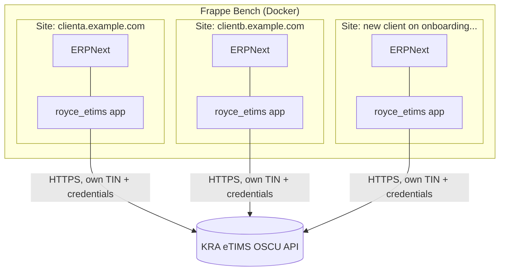
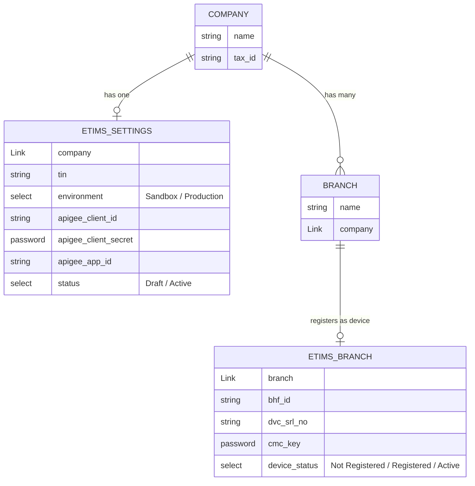
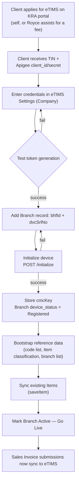
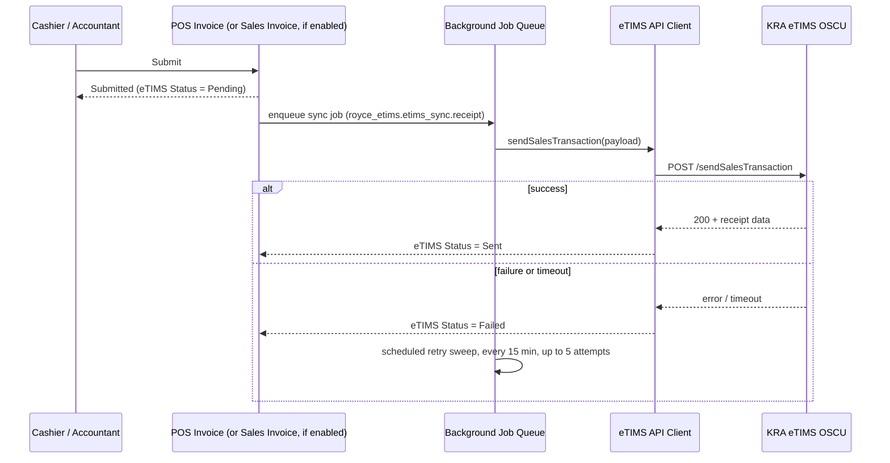

# Royce eTIMS — Architecture Reference

Status: **in progress**. Foundation (Settings/Branch/Log), Item sync, and receipt sync (POS
Invoice + gated Sales Invoice) are implemented and functionally verified against the KRA sandbox.
Captures the decisions made so far so we don't re-litigate them. Update this file as decisions
change — it's meant to stay current, not to be a one-time snapshot.

## Decisions locked so far

- **Device model:** start with **OSCU** (online, real-time signing). VSCU (offline-tolerant
  signing) is a candidate v2 once we pull its spec and diff it against OSCU — the two are not
  assumed to be a drop-in swap.
- **Tenancy:** one Frappe **site per client**, all on the same bench. Site-level isolation gives us
  tenant data separation for free; `royce_etims` itself doesn't need to know it's multi-tenant.
- **Registration granularity:** eTIMS credentials are **not** flat per-site. A taxpayer (Company /
  TIN) can have several registered branches (`bhfId`), and KRA issues a separate device
  (`dvcSrlNo` → `cmcKey`) **per branch**, not per company. The data model reflects that split:
  - `eTIMS Settings` — one per **Company**: TIN, environment (Sandbox/Production), Apigee
    credentials, overall status.
  - `eTIMS Branch` — one per **Branch** (KRA's `bhfId`) under a Company: device serial, `cmcKey`,
    device status. Reuses ERPNext's existing `Branch` doctype as the anchor rather than inventing
    a parallel one.
- **KRA-side onboarding (applying for TIN registration, getting Apigee `client_id`/`client_secret`):**
  not automated for now. The app presents it as a checklist step; client either does it themselves
  or we do it for them as a paid-assist service. Revisit once/if we pursue KRA "verified
  third-party integrator" status.
- **Receipt sync is asynchronous.** Submission in ERPNext is never blocked on KRA's API. Sync
  happens as a background job with a visible status field and automatic retry.
- **What gets signed: receipts, not invoices — for now.** KRA's OSCU API has one call for this,
  `sendSalesTransaction` — there's no separate "sign invoice" vs "sign receipt" endpoint. What we
  control is which ERPNext event triggers it. Two doctypes can, gated independently per company on
  `eTIMS Settings`:
  - **POS Invoice** (`sign_pos_invoices`, **on by default**) — point-of-sale, payment collected
    immediately. Closest match to a fiscal receipt: final, no credit/cancellation complexity.
  - **Sales Invoice** (`sign_sales_invoices`, **off by default**) — general/credit invoice, can be
    issued unpaid. Deliberately not signed yet — credit invoices raise timing/amendment questions
    (see Open items below) that haven't been resolved. Turning this on is meant to be a deliberate
    per-company decision, not a default.

- **Reference data as real doctypes, item codes as a mapping table, not flat fields.** Patterns
  borrowed from `navari_csf_ke`'s `etims` module (a data-model scaffold for eTIMS - not a working
  KRA connector; it has no HTTP calls and no doc_events wiring anything to KRA, so this was borrowed
  for shape/ideas only, not code):
  - `eTIMS Item Classification`, `eTIMS Taxation Type` (carries `rate`), `eTIMS Item Type`,
    `eTIMS Packaging Unit`, `eTIMS Quantity Unit`, `eTIMS Country of Origin` — Link-able reference
    doctypes instead of free-text/Select fields on Item. Only Taxation Type and Item Type are
    seeded (from real values in the sandbox collection) — the rest are deliberately empty pending
    real `selectCodeList`/`selectItemClass` sync, not filled with guesses.
  - **`eTIMS ID Mapping`** (generic child table: `setup_doctype` + `setup_docname` + `etims_id`) —
    fixes the multi-company limitation flagged earlier: itemCd is assigned per taxpayer
    registration, not globally to the Item, so it lives in a child table keyed by company
    (`eTIMS Settings`) rather than a flat `etims_item_code` field. Reusable for Customer/Supplier
    later without a schema change.
  - Tax rate for `sendSalesTransaction`'s `taxRtA..E` now comes live from `eTIMS Taxation Type`,
    replacing what was a hardcoded `TAX_RATE_BY_CODE` dict in `etims_sync/receipt.py`.
  - `prevent_etims_submission` escape hatch added to Item, Sales Invoice, and POS Invoice.

## Open / not yet decided

- Whether v1 needs multi-branch support day one or can ship single-branch first (leaning toward
  building the model correctly now since retrofitting is expensive, but scope of the *UI* for it
  can be trimmed).
- VSCU spec diff — not yet pulled.
- Whether Royce Technologies pursues KRA third-party integrator certification.
- Payroll-compliance side of the product — separate workstream, not covered by this doc.

---

## 1. Multi-tenant deployment

Each site is a fully isolated tenant (own database). Onboarding a client = new site +
`install-app royce_etims`, handled by provisioning tooling outside this app.

## 2. Data model — Company / Branch / device

`ETIMS_SETTINGS` carries what's shared across the whole taxpayer (TIN, Apigee app credentials,
environment). `ETIMS_BRANCH` carries what's specific to a physical outlet — because that's the
actual grain KRA's `/initialize` call operates at (`tin` + `bhfId` + `dvcSrlNo` → `cmcKey`).

## 3. Onboarding flow

Each branch under a company repeats steps E–J independently — a company with 3 branches does 3
device initializations, each gated by its own confirm step (irreversible, environment-sensitive
action).

## 4. Runtime — receipt sync (POS Invoice by default; Sales Invoice if enabled)

Submission in ERPNext never blocks on KRA. Failure surfaces as a status the accountant can see
and a retry worker chases automatically. Both doctypes share one handler
(`royce_etims/etims_sync/receipt.py`) since KRA's per-device invoice sequence (`invcNo`) has to
stay monotonic regardless of which ERPNext document triggered it.
