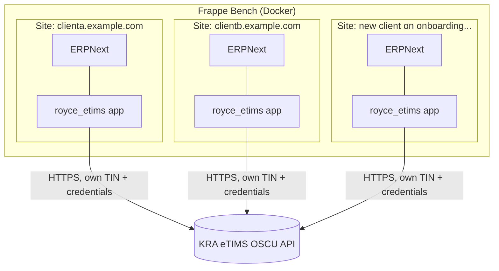
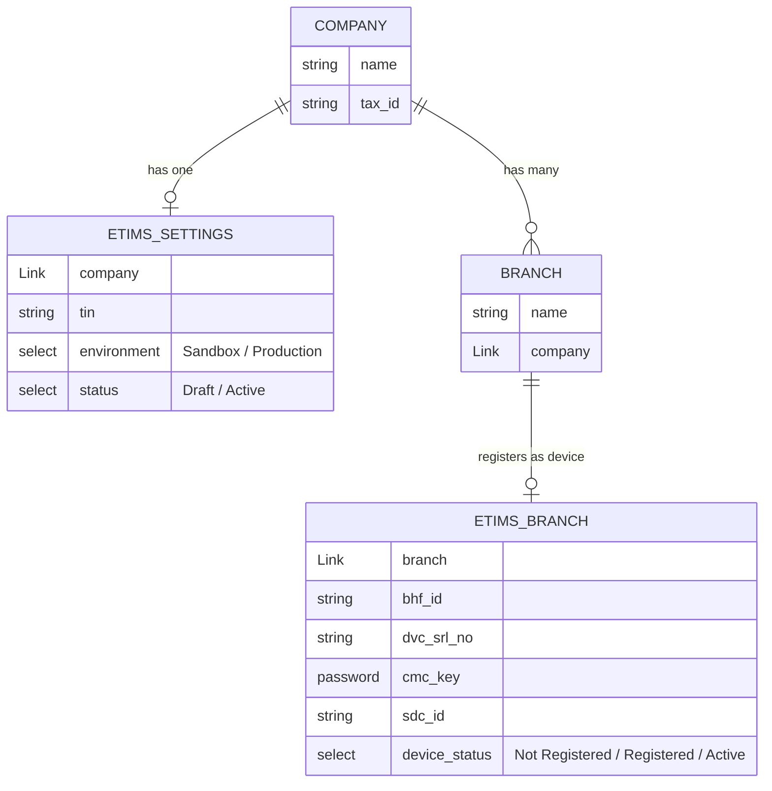
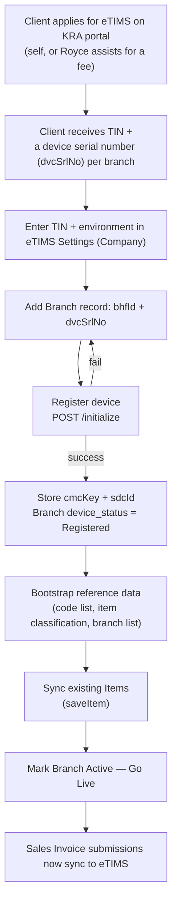
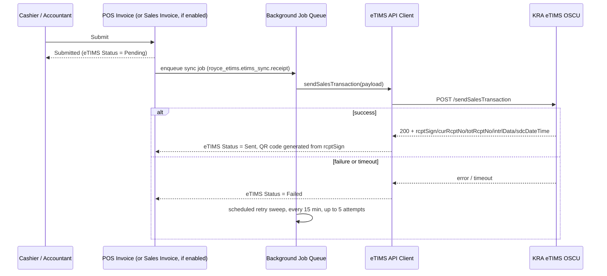

# Royce eTIMS — Architecture Reference

Status: **in progress**. Foundation (Settings/Branch/Log), Item sync, and receipt sync (POS
Invoice + gated Sales Invoice) are implemented. Captures the decisions made so far so we don't
re-litigate them. Update this file as decisions change — it's meant to stay current, not to be a
one-time snapshot.

## Critical correction: the original API surface was wrong

The app was first built from `eTIMS-OSCU-Integrator-Automated-Testing-Sandbox.json`, a Postman
collection targeting `sbx.kra.go.ke/etims-oscu/api/v1` with an Apigee OAuth2 client-credentials
layer in front (an "Access Token" request, `apigee_client_id`/`secret`, `Authorization: Bearer`).
That host is real and responds (a clean HTTP 400), which read as confirmation at the time.

It wasn't. Cross-checked against two independent sources - KRA's own **official OSCU
Specification Document v2.0**, and **navariltd/kenya-compliance** (an ERPNext OSCU integration
actually tested against the KRA sandbox in 2024, cloned locally for study) - both agree on a
different picture:

- **Correct base URL:** `https://etims-api-sbx.kra.go.ke` (sandbox), `https://etims-api.kra.go.ke`
  (production) - a different host entirely, not a typo of the original. **Corrected a second time**
  after directly reading KRA's own official "eTIMS OSCU AND VSCU Step-by-Step Guide" (v1.1): its
  page 8 worked example gives the full URL as `https://etims-api-sbx.kra.go.ke/selectInitOsdcInfo`
  - no `/etims-api` path segment, which the first correction (based on kenya-compliance's
  `SANDBOX_SERVER_URL` constant) had included. The primary source wins; the constant was likely a
  stale default real deployments overrode via their own editable `server_url` setting.
- **No OAuth layer at all.** kenya-compliance's Settings doctype has no client_id/secret/token
  field, and its whole codebase has zero bearer-token code. Every call authenticates with
  `tin`/`bhfId`/`cmcKey` headers only - the device credential *is* the auth, no separate token
  step in front of it.
- **Most endpoint paths differ**, not just the host - e.g. `saveTrnsSalesOsdc` (not
  `sendSalesTransaction`, the call our entire receipt-signing feature makes), `selectInitOsdcInfo`
  (not `initialize`), `selectBhfList` (not `branchList`). Only `saveItem`, `selectCodeList`,
  `selectNoticeList`, `saveItemComposition` happened to match.

Both `sbx.kra.go.ke` and `etims-api-sbx.kra.go.ke` are genuinely live, cert-valid, KRA-owned hosts
- this wasn't a dead/fake endpoint, it was a *different real one*, most likely a legacy or
unrelated program sharing superficially similar naming. A host responding is not the same as it
being *the* documented, currently-correct one.

**What changed as a result** (see `git log` for the exact commit): `utils/config.py`'s URLs,
`utils/api_client.py`'s auth (OAuth flow removed entirely), `eTIMS Settings` (Apigee fields
dropped - nothing left to hold), `eTIMS Branch` (added `sdc_id`, alongside `cmcKey`, both
confirmed returned by `selectInitOsdcInfo`), every endpoint name in `etims_sync/`, and new fields
on Sales Invoice/POS Invoice for KRA's confirmed `saveTrnsSalesOsdc` response
(`rcptSign`/`curRcptNo`/`totRcptNo`/`intrlData`/`sdcDateTime`) plus real QR code generation from
it - all resolving prior TODOs that had been honestly flagged as guesses (`_extract_cmc_key`'s
"best-effort" shape, the raw-response dump with no QR code) rather than treated as settled.

**What this doesn't change:** the payload *shapes* we'd already built (item fields, tax bucketing,
`saveItem`'s field names) turned out to match kenya-compliance's real, tested payloads closely -
the correction is entirely in the transport layer (host, paths, auth), not the business logic.

**Still unverified:** none of this has completed a live round-trip against KRA from this
environment - the corrected host resets unauthenticated/unregistered connections at the network
level (consistent with IP-whitelisted sandbox access, not evidence the correction is wrong).
Verified instead by mocking the network boundary and exercising the real code paths against the
confirmed response shapes. Real sandbox credentials would be the next level of confidence beyond
this.

## Second critical correction, 2026-09-05: the pendulum swung back

The correction above was itself wrong, at least for the route this taxpayer was actually told to
use. What happened: Royce Technologies LTD emailed KRA's eTIMS integration support directly and
was told to proceed via **GavaConnect** (`developer.go.ke`) - KRA's own official Enterprise API
platform. Reading `developer.go.ke/apis/KRA-ETIMS-SBX` directly (KRA's own current documentation,
not a third party's) confirms, verbatim:

> "Sandbox environment use: **https://sbx.kra.go.ke** ... the URL path for OSCU device activation
> is indicated as (url: /initialize); therefore, the full URL path is
> **https://sbx.kra.go.ke/etims-oscu/api/v1/initialize** in the sandbox environment."

That is the **original** Postman collection's host and path structure, word for word - the thing
the first correction concluded was "a different real one... most likely a legacy or unrelated
program." It wasn't. Endpoint names throughout that GavaConnect page also match the original
collection, not kenya-compliance's:

| Category | Confirmed endpoint (GavaConnect docs) | kenya-compliance's name (now believed wrong for this route) |
|---|---|---|
| Initialization | `/initialize` | `selectInitOsdcInfo` |
| Sales | `/sendSalesTransaction` | `saveTrnsSalesOsdc` |
| Branch list | `/selectBhfList` | `selectBhfList` (matched) |
| Item save | `/saveItem` | `saveItem` (matched) |
| Purchase get/send | `/getPurchaseTransactionInfo`, `/sendPurchaseTransactionInfo` | different names |
| Stock | `/selectStockMoveLists`, `/insert/stockIO`, `/save/stockMaster` | different names |

`utils/config.py` and every endpoint name in `etims_sync/` and `eTIMS Branch.register_device()`
have been changed back to match GavaConnect. **What's still not established:** whether
`etims-api-sbx.kra.go.ke` (the second correction's host, from the OSCU Spec Document v2.0 and
kenya-compliance) is a genuinely different/older/parallel API generation that still works, is being
deprecated in favour of GavaConnect, or was never right either - not resolved, and not this
taxpayer's documented path regardless. Don't resurrect it without a specific reason to.

**Auth layer - still open.** GavaConnect's "Common Headers" table lists only tin/bhfId/cmcKey, no
Bearer token, for the actual business endpoints. But GavaConnect also requires a mandatory "App
creation" step before testing - normally how Apigee-fronted APIs gate access via an OAuth
client-credentials token, exactly like the original collection's `/v1/token/generate` flow. Whether
that's actually required in addition to tin/bhfId/cmcKey is unconfirmed. `api_client.py`
deliberately does NOT implement it yet - added when a live call actually demands it, not before.

**The "Integration Token" turned out to be something else entirely.** The taxpayer received a
token (`KRATK04_de39f`) via email, alongside PIN/company/system name/version/device serial. This
was first guessed to be a GavaConnect Apigee app credential. It isn't - it's a field literally
labelled "Integration Token" on the **eTIMS Taxpayer Sandbox Portal's Service Request form**
(`etims-sbx.kra.go.ke`, a different portal from GavaConnect entirely), with a "Verify" button,
gating that specific Service Request. Submitting it hit **"Device Serial Number already used."**

**Device serial numbers are self-chosen, not hardware IDs - and this explains the collision.**
Odoo's own eTIMS integration confirms the pattern directly: *"an OSCU serial number is generated
for each company... starting with the prefix `ODOO` followed by the company's VAT number and a
sequence of numbers."* The serial supplied (`5CD6472Z8WR`) has exactly the shape of a real
Windows/Dell hardware serial - a reasonable first instinct, but exactly the kind of value likely to
collide (someone else's sandbox test, a stale prior attempt, shared demo hardware). `eTIMS
Branch.validate()` now auto-generates one (`ROYCEERP-<tin>-<sequence>`) if left blank, matching
Odoo's scheme, rather than asking for a real machine serial.

**The real onboarding process is much heavier than this doc previously assumed** - see the revised
step list below. It's not "register device, get cmcKey, start signing" - there's automated app
testing with uploaded artefacts, a full KYC document set, a scheduled joint verification demo with
KRA staff, and (for third-party integrators) SLA execution, all before production keys are issued.

## Getting real sandbox credentials — next step

Confirmed 2026-09-05 against GavaConnect's own onboarding walkthrough (`developer.go.ke/apis/
KRA-ETIMS-SBX`) - this is the real process, considerably heavier than the earlier 4-step summary
this doc previously had:

1. **Sign up** at the eTIMS taxpayer sandbox portal (`etims-sbx.kra.go.ke`) - PIN, OTP, password.
2. **Service Request → eTIMS → select eTims type** (OSCU / VSCU / eTIMS Client / eTIMS Online) -
   this form has an **"Integration Token"** field with a Verify button (see the correction above -
   this is a KRA-support-issued token gating the request, tied to your PIN + system name + version
   + device serial, not a GavaConnect app credential). Upload a signed eTIMS Commitment Form.
   Approval arrives by SMS - not instant.
3. **App creation** on GavaConnect itself - separate from step 2, this is the Apigee-style app
   registration the API-gateway layer needs (see the open auth-layer question above).
4. **Discovery and simulation** - use the portal's "Simulate API" tool / downloadable Postman
   collection to explore before writing code against it.
5. **Automated App Testing** on the Developer Platform, then **upload test artefacts** (item
   creation screenshot, invoice generation screenshot, invoice copy, credit note copy) within one
   hour of the test completing.
6. **KYC documentation** - eTIMS Bio Data Form, Business Registration + CR12, Business Permit,
   National ID, Tax Compliance Certificate, proof of 3 qualified technical staff, and - **only if
   registering as a third-party integrator, not a self-integrator** - a notarized solvency
   declaration and a Technology Architecture document. Self-integrators only need 4 of the 8 items.
7. **Verification** - schedule a date, KRA reviews artefacts, then a **joint verification demo
   meeting** with KRA staff where the system's invoice/credit-note handling is demonstrated live.
8. **SLA execution** (third-party integrators only - conducted outside the system) or an **interim
   approval letter** (self-integrators - no SLA needed).
9. **Production keys** issued through the portal, then go-live.

**The strategic fork this implies for "easier client onboarding":** this entire process runs per
*taxpayer PIN* - registering Royce Technologies LTD's own PIN (in progress) does not automatically
cover any future client's PIN. Two models, not yet decided between:

- **Self-integrator per client** - every future client repeats steps 1-9 under their own PIN,
  choosing RoyceERP as their system. Lighter KYC per client, but a multi-week KRA-approval
  dependency sits in the critical path of *every single client onboarding* - directly undermines
  the "guided, fast setup" pitch the rest of this product (see the sibling `kenyan_accountant` app)
  is built around.
- **Royce certified as a third-party integrator** - steps 3-8 done once, thoroughly, for RoyceERP
  itself (heavier KYC, SLA, one real demo). Each subsequent client then only needs the lighter
  taxpayer-side steps (1-2, their own PIN/device), not a full re-proof of the software. Better
  match for the onboarding-ease goal, but a real compliance investment up front - track it as its
  own workstream with an owner, not an engineering task.

Worth noting from KRA's Step-by-Step Guide: **VSCU is architecturally different, not just a
different URL** - it's a Java JAR (`etims-vscu-<version>.jar`, requires JRE/JDK 16+) deployed and
run **on the taxpayer's own server**, which then talks to KRA - not a cloud API royce_etims would
call directly the way OSCU is. If VSCU is ever pursued, that's a deployment-model decision, not
just a config change.

## Decisions locked so far

- **Device model:** start with **OSCU** (online, real-time signing, hosted at KRA - we call their
  API directly). VSCU (local JAR deployed on the client's own server, offline-tolerant signing) is
  a candidate v2 - see the sandbox-credentials section above for why it's not a drop-in swap.
- **Tenancy:** one Frappe **site per client**, all on the same bench. Site-level isolation gives us
  tenant data separation for free; `royce_etims` itself doesn't need to know it's multi-tenant.
- **Registration granularity:** eTIMS credentials are **not** flat per-site. A taxpayer (Company /
  TIN) can have several registered branches (`bhfId`), and KRA issues a separate device
  (`dvcSrlNo` → `cmcKey`) **per branch**, not per company. The data model reflects that split:
  - `eTIMS Settings` — one per **Company**: TIN, environment (Sandbox/Production), overall status.
    No credentials fields - there's nothing to hold; see the correction note above.
  - `eTIMS Branch` — one per **Branch** (KRA's `bhfId`) under a Company: device serial, `cmcKey`,
    `sdc_id`, device status. Reuses ERPNext's existing `Branch` doctype as the anchor rather than
    inventing a parallel one.
- **KRA-side onboarding (applying for TIN registration, getting a device serial number
  (`dvcSrlNo`) issued):** not automated for now. The app presents it as a checklist step; client
  either does it themselves or we do it for them as a paid-assist service. Revisit once/if we
  pursue KRA "verified third-party integrator" status.
- **Receipt sync is asynchronous.** Submission in ERPNext is never blocked on KRA's API. Sync
  happens as a background job with a visible status field and automatic retry.
- **What gets signed: receipts, not invoices — for now.** KRA's OSCU API has one call for this,
  `sendSalesTransaction` — there's no separate "sign invoice" vs "sign receipt" endpoint. What we
  control is which ERPNext event triggers it. Two doctypes can, gated independently per company on
  `eTIMS Settings`:
  - **POS Invoice** (`sign_pos_invoices`, **on by default**) — point-of-sale, payment collected
    immediately. Closest match to a fiscal receipt: final, no credit/cancellation complexity.
  - **Sales Invoice** (`sign_sales_invoices`, **off by default**) — general/credit invoice, can be
    issued unpaid. Deliberately not signed yet — credit invoices raise timing/amendment questions
    (see Open items below) that haven't been resolved. Turning this on is meant to be a deliberate
    per-company decision, not a default.

- **Reference data as real doctypes, item codes as a mapping table, not flat fields.** Patterns
  borrowed from `navari_csf_ke`'s `etims` module (a data-model scaffold for eTIMS - not a working
  KRA connector; it has no HTTP calls and no doc_events wiring anything to KRA, so this was borrowed
  for shape/ideas only, not code):
  - `eTIMS Item Classification`, `eTIMS Taxation Type` (carries `rate`), `eTIMS Item Type`,
    `eTIMS Packaging Unit`, `eTIMS Quantity Unit`, `eTIMS Country of Origin` — Link-able reference
    doctypes instead of free-text/Select fields on Item. Only Taxation Type and Item Type are
    seeded (from real values in the sandbox collection) — the rest are deliberately empty pending
    real `selectCodeList`/`selectItemClass` sync, not filled with guesses.
  - **`eTIMS ID Mapping`** (generic child table: `setup_doctype` + `setup_docname` + `etims_id`) —
    fixes the multi-company limitation flagged earlier: itemCd is assigned per taxpayer
    registration, not globally to the Item, so it lives in a child table keyed by company
    (`eTIMS Settings`) rather than a flat `etims_item_code` field. Reusable for Customer/Supplier
    later without a schema change.
  - Tax rate for `sendSalesTransaction`'s `taxRtA..E` now comes live from `eTIMS Taxation Type`,
    replacing what was a hardcoded `TAX_RATE_BY_CODE` dict in `etims_sync/receipt.py`.
  - `prevent_etims_submission` escape hatch added to Item, Sales Invoice, and POS Invoice.

## Open / not yet decided

- **Self-integrator vs certified third-party integrator** (added 2026-09-05, see the correction
  above) - the single biggest unresolved question for the "easier client onboarding" goal. Needs a
  business decision, not a code change; CTO recommendation is third-party integrator, for scale.
- Whether the GavaConnect Apigee OAuth layer (a Bearer token on top of tin/bhfId/cmcKey) is
  actually required - unconfirmed both ways. First thing to check once any live call is attempted.
- `/initialize` and `sendSalesTransaction`'s exact response envelopes are not re-confirmed against
  GavaConnect's own docs (their Response Body sections weren't readable in the copy fetched) -
  still running on kenya-compliance's shape as a best guess. Verify against the first real response.
- Production base URL for GavaConnect is not confirmed at all - `PRODUCTION_BASE_URL` is
  deliberately left empty in `utils/config.py` rather than guessed.
- Whether `etims-api-sbx.kra.go.ke` (the abandoned second correction's host) is a dead end, a
  parallel API generation, or something still worth supporting later - not investigated further.
- Whether v1 needs multi-branch support day one or can ship single-branch first (leaning toward
  building the model correctly now since retrofitting is expensive, but scope of the *UI* for it
  can be trimmed).
- VSCU spec diff — not yet pulled. Worth re-checking against kenya-compliance too, now that it's
  cloned locally, rather than the OSCU spec PDF alone.
- Whether Royce Technologies pursues KRA third-party integrator certification.
- Payroll-compliance side of the product — separate workstream, not covered by this doc.
- Production QR-verification host (`PRODUCTION_QR_VERIFY_BASE_URL`) is inferred by pattern
  (sbx-suffix removed), not independently confirmed the way the other corrected URLs were -
  confirm before going live.
- No live round-trip against KRA yet from any environment - see the correction note above. Real
  sandbox credentials are the natural next step once available.
- `selectCodeList`/`selectItemClass`/`branchList` reference-data sync — the task this correction
  interrupted. Now unblocked with confirmed endpoint names (`selectCodeList` was already right;
  `selectItemClass` should be `selectItemClsList`, `branchList` should be `selectBhfList`) - still
  to be built.

---

## 1. Multi-tenant deployment

```mermaid
flowchart TB
    subgraph Bench["Frappe Bench (Docker)"]
        subgraph SiteA["Site: clienta.example.com"]
            ERPA[ERPNext]
            EtimsA[royce_etims app]
            ERPA --- EtimsA
        end
        subgraph SiteB["Site: clientb.example.com"]
            ERPB[ERPNext]
            EtimsB[royce_etims app]
            ERPB --- EtimsB
        end
        subgraph SiteN["Site: new client on onboarding..."]
            ERPN[ERPNext]
            EtimsN[royce_etims app]
            ERPN --- EtimsN
        end
    end

    EtimsA -->|HTTPS, own TIN + credentials| KRA[(KRA eTIMS OSCU API)]
    EtimsB -->|HTTPS, own TIN + credentials| KRA
    EtimsN -->|HTTPS, own TIN + credentials| KRA
```

Each site is a fully isolated tenant (own database). Onboarding a client = new site +
`install-app royce_etims`, handled by provisioning tooling outside this app.

## 2. Data model — Company / Branch / device

```mermaid
erDiagram
    COMPANY ||--o| ETIMS_SETTINGS : "has one"
    COMPANY ||--o{ BRANCH : "has many"
    BRANCH ||--o| ETIMS_BRANCH : "registers as device"

    COMPANY {
        string name
        string tax_id
    }
    ETIMS_SETTINGS {
        Link company
        string tin
        select environment "Sandbox / Production"
        select status "Draft / Active"
    }
    BRANCH {
        string name
        Link company
    }
    ETIMS_BRANCH {
        Link branch
        string bhf_id
        string dvc_srl_no
        password cmc_key
        string sdc_id
        select device_status "Not Registered / Registered / Active"
    }
```

`ETIMS_SETTINGS` carries what's shared across the whole taxpayer (TIN, environment). `ETIMS_BRANCH`
carries what's specific to a physical outlet — because that's the actual grain KRA's
`/initialize` call operates at (`tin` + `bhfId` + `dvcSrlNo` → `cmcKey` + `sdcId`).

## 3. Onboarding flow

```mermaid
flowchart TD
    A["Client applies for eTIMS on KRA portal\n(self, or Royce assists for a fee)"] --> B["Client receives TIN +\na device serial number (dvcSrlNo) per branch"]
    B --> C["Enter TIN + environment in eTIMS Settings (Company)"]
    C --> D["Add Branch record: bhfId + dvcSrlNo"]
    D --> E["Register device\nPOST /initialize"]
    E -- fail --> D
    E -- success --> F["Store cmcKey + sdcId\nBranch device_status = Registered"]
    F --> G["Bootstrap reference data\n(code list, item classification, branch list)"]
    G --> H["Sync existing Items\n(saveItem)"]
    H --> I["Mark Branch Active — Go Live"]
    I --> J["Sales Invoice submissions now sync to eTIMS"]
```

No separate credentials-test step — there's no OAuth layer in front of the real API (see the
correction note above), so device registration is itself the first genuine connectivity check.
Each branch under a company repeats steps D–I independently — a company with 3 branches does 3
device registrations, each gated by its own confirm step (irreversible, environment-sensitive
action).

## 4. Runtime — receipt sync (POS Invoice by default; Sales Invoice if enabled)

```mermaid
sequenceDiagram
    participant U as Cashier / Accountant
    participant D as POS Invoice (or Sales Invoice, if enabled)
    participant Q as Background Job Queue
    participant API as eTIMS API Client
    participant KRA as KRA eTIMS OSCU

    U->>D: Submit
    D-->>U: Submitted (eTIMS Status = Pending)
    D->>Q: enqueue sync job (royce_etims.etims_sync.receipt)
    Q->>API: sendSalesTransaction(payload)
    API->>KRA: POST /sendSalesTransaction
    alt success
        KRA-->>API: 200 + rcptSign/curRcptNo/totRcptNo/intrlData/sdcDateTime
        API-->>D: eTIMS Status = Sent, QR code generated from rcptSign
    else failure or timeout
        KRA-->>API: error / timeout
        API-->>D: eTIMS Status = Failed
        Q->>Q: scheduled retry sweep, every 15 min, up to 5 attempts
    end
```

Submission in ERPNext never blocks on KRA. Failure surfaces as a status the accountant can see
and a retry worker chases automatically. Both doctypes share one handler
(`royce_etims/etims_sync/receipt.py`) since KRA's per-device invoice sequence (`invcNo`) has to
stay monotonic regardless of which ERPNext document triggered it. The QR code encodes a
verification URL built from `tin` + `bhfId` + `rcptSign` against KRA's public receipt-verification
host - a third host, distinct from both the API host and the two above (confirmed from
kenya-compliance's QR-generation code).
