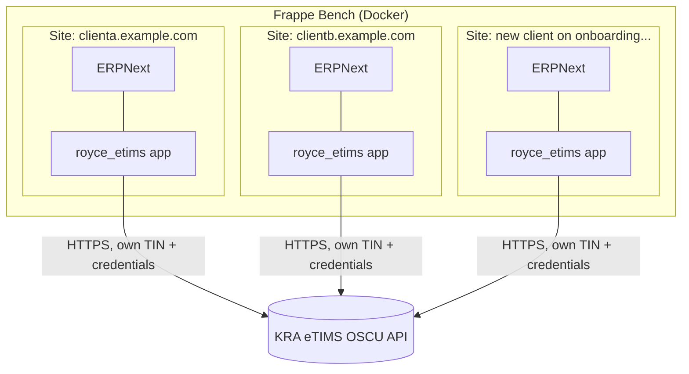
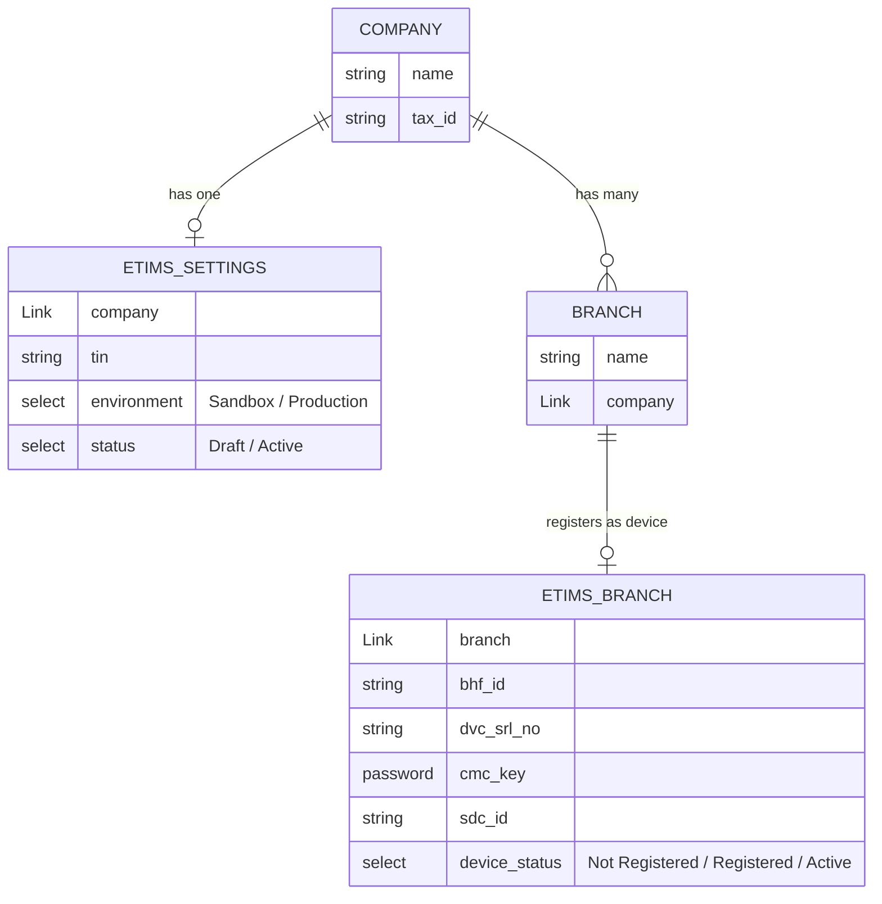
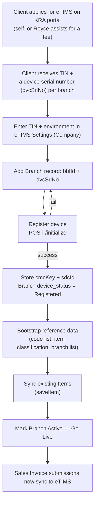
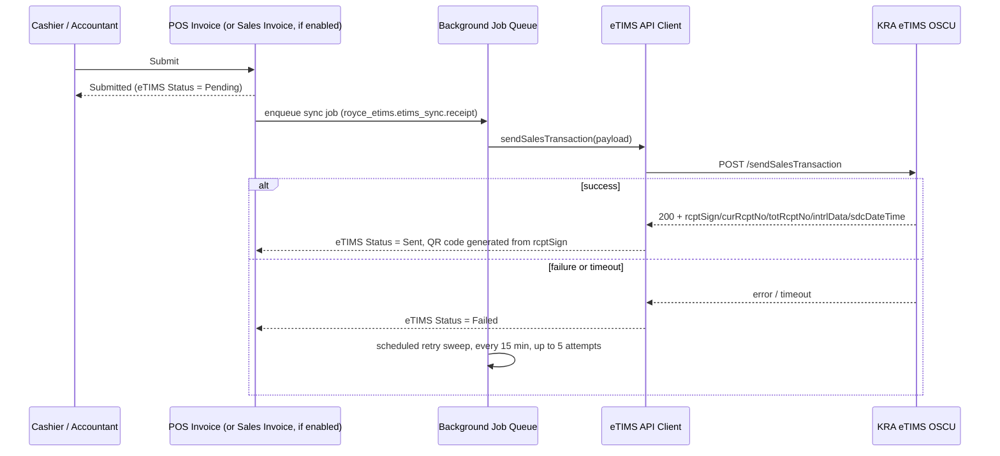

# Royce eTIMS — Architecture Reference

Status: **in progress**. Foundation (Settings/Branch/Log), Item sync, and receipt sync (POS
Invoice + gated Sales Invoice) are implemented. Captures the decisions made so far so we don't
re-litigate them. Update this file as decisions change — it's meant to stay current, not to be a
one-time snapshot.

**Looking for how to actually initialize a device or make an authenticated call?** See
[`oscu-integration-guide.md`](./oscu-integration-guide.md) — that's the operating manual (settled,
current steps). This file is the decision log (why things are built this way, and the sometimes
painful history of how each piece got confirmed) — read it when you need the reasoning, not when
you just need to get something working.

## Critical correction: the original API surface was wrong

The app was first built from `eTIMS-OSCU-Integrator-Automated-Testing-Sandbox.json`, a Postman
collection targeting `sbx.kra.go.ke/etims-oscu/api/v1` with an Apigee OAuth2 client-credentials
layer in front (an "Access Token" request, `apigee_client_id`/`secret`, `Authorization: Bearer`).
That host is real and responds (a clean HTTP 400), which read as confirmation at the time.

It wasn't. Cross-checked against two independent sources - KRA's own **official OSCU
Specification Document v2.0**, and **navariltd/kenya-compliance** (an ERPNext OSCU integration
actually tested against the KRA sandbox in 2024, cloned locally for study) - both agree on a
different picture:

- **Correct base URL:** `https://etims-api-sbx.kra.go.ke` (sandbox), `https://etims-api.kra.go.ke`
  (production) - a different host entirely, not a typo of the original. **Corrected a second time**
  after directly reading KRA's own official "eTIMS OSCU AND VSCU Step-by-Step Guide" (v1.1): its
  page 8 worked example gives the full URL as `https://etims-api-sbx.kra.go.ke/selectInitOsdcInfo`
  - no `/etims-api` path segment, which the first correction (based on kenya-compliance's
  `SANDBOX_SERVER_URL` constant) had included. The primary source wins; the constant was likely a
  stale default real deployments overrode via their own editable `server_url` setting.
- **No OAuth layer at all.** kenya-compliance's Settings doctype has no client_id/secret/token
  field, and its whole codebase has zero bearer-token code. Every call authenticates with
  `tin`/`bhfId`/`cmcKey` headers only - the device credential *is* the auth, no separate token
  step in front of it.
- **Most endpoint paths differ**, not just the host - e.g. `saveTrnsSalesOsdc` (not
  `sendSalesTransaction`, the call our entire receipt-signing feature makes), `selectInitOsdcInfo`
  (not `initialize`), `selectBhfList` (not `branchList`). Only `saveItem`, `selectCodeList`,
  `selectNoticeList`, `saveItemComposition` happened to match.

Both `sbx.kra.go.ke` and `etims-api-sbx.kra.go.ke` are genuinely live, cert-valid, KRA-owned hosts
- this wasn't a dead/fake endpoint, it was a *different real one*, most likely a legacy or
unrelated program sharing superficially similar naming. A host responding is not the same as it
being *the* documented, currently-correct one.

**What changed as a result** (see `git log` for the exact commit): `utils/config.py`'s URLs,
`utils/api_client.py`'s auth (OAuth flow removed entirely), `eTIMS Settings` (Apigee fields
dropped - nothing left to hold), `eTIMS Branch` (added `sdc_id`, alongside `cmcKey`, both
confirmed returned by `selectInitOsdcInfo`), every endpoint name in `etims_sync/`, and new fields
on Sales Invoice/POS Invoice for KRA's confirmed `saveTrnsSalesOsdc` response
(`rcptSign`/`curRcptNo`/`totRcptNo`/`intrlData`/`sdcDateTime`) plus real QR code generation from
it - all resolving prior TODOs that had been honestly flagged as guesses (`_extract_cmc_key`'s
"best-effort" shape, the raw-response dump with no QR code) rather than treated as settled.

**What this doesn't change:** the payload *shapes* we'd already built (item fields, tax bucketing,
`saveItem`'s field names) turned out to match kenya-compliance's real, tested payloads closely -
the correction is entirely in the transport layer (host, paths, auth), not the business logic.

**Still unverified:** none of this has completed a live round-trip against KRA from this
environment - the corrected host resets unauthenticated/unregistered connections at the network
level (consistent with IP-whitelisted sandbox access, not evidence the correction is wrong).
Verified instead by mocking the network boundary and exercising the real code paths against the
confirmed response shapes. Real sandbox credentials would be the next level of confidence beyond
this.

## Second critical correction, 2026-09-05: the pendulum swung back

The correction above was itself wrong, at least for the route this taxpayer was actually told to
use. What happened: Royce Technologies LTD emailed KRA's eTIMS integration support directly and
was told to proceed via **GavaConnect** (`developer.go.ke`) - KRA's own official Enterprise API
platform. Reading `developer.go.ke/apis/KRA-ETIMS-SBX` directly (KRA's own current documentation,
not a third party's) confirms, verbatim:

> "Sandbox environment use: **https://sbx.kra.go.ke** ... the URL path for OSCU device activation
> is indicated as (url: /initialize); therefore, the full URL path is
> **https://sbx.kra.go.ke/etims-oscu/api/v1/initialize** in the sandbox environment."

That is the **original** Postman collection's host and path structure, word for word - the thing
the first correction concluded was "a different real one... most likely a legacy or unrelated
program." It wasn't. Endpoint names throughout that GavaConnect page also match the original
collection, not kenya-compliance's:

| Category | Confirmed endpoint (GavaConnect docs) | kenya-compliance's name (now believed wrong for this route) |
|---|---|---|
| Initialization | `/initialize` | `selectInitOsdcInfo` |
| Sales | `/sendSalesTransaction` | `saveTrnsSalesOsdc` |
| Branch list | `/selectBhfList` | `selectBhfList` (matched) |
| Item save | `/saveItem` | `saveItem` (matched) |
| Purchase get/send | `/getPurchaseTransactionInfo`, `/sendPurchaseTransactionInfo` | different names |
| Stock | `/selectStockMoveLists`, `/insert/stockIO`, `/save/stockMaster` | different names |

`utils/config.py` and every endpoint name in `etims_sync/` and `eTIMS Branch.register_device()`
have been changed back to match GavaConnect. **What's still not established:** whether
`etims-api-sbx.kra.go.ke` (the second correction's host, from the OSCU Spec Document v2.0 and
kenya-compliance) is a genuinely different/older/parallel API generation that still works, is being
deprecated in favour of GavaConnect, or was never right either - not resolved, and not this
taxpayer's documented path regardless. Don't resurrect it without a specific reason to.

**Auth layer - still open.** GavaConnect's "Common Headers" table lists only tin/bhfId/cmcKey, no
Bearer token, for the actual business endpoints. But GavaConnect also requires a mandatory "App
creation" step before testing - normally how Apigee-fronted APIs gate access via an OAuth
client-credentials token, exactly like the original collection's `/v1/token/generate` flow. Whether
that's actually required in addition to tin/bhfId/cmcKey is unconfirmed. `api_client.py`
deliberately does NOT implement it yet - added when a live call actually demands it, not before.

**The "Integration Token" turned out to be something else entirely.** The taxpayer received a
token (`KRATK04_de39f`) via email, alongside PIN/company/system name/version/device serial. This
was first guessed to be a GavaConnect Apigee app credential. It isn't - it's a field literally
labelled "Integration Token" on the **eTIMS Taxpayer Sandbox Portal's Service Request form**
(`etims-sbx.kra.go.ke`, a different portal from GavaConnect entirely), with a "Verify" button,
gating that specific Service Request. Submitting it hit **"Device Serial Number already used."**

**Device serial numbers are self-chosen, not hardware IDs - and this explains the collision.**
Odoo's own eTIMS integration confirms the pattern directly: *"an OSCU serial number is generated
for each company... starting with the prefix `ODOO` followed by the company's VAT number and a
sequence of numbers."* The serial supplied (`5CD6472Z8WR`) has exactly the shape of a real
Windows/Dell hardware serial - a reasonable first instinct, but exactly the kind of value likely to
collide (someone else's sandbox test, a stale prior attempt, shared demo hardware). `eTIMS
Branch.validate()` now auto-generates one (`ROYCEERP-<tin>-<sequence>`) if left blank, matching
Odoo's scheme, rather than asking for a real machine serial.

**Resolution, 2026-09-10 (revises the theory above): the uniqueness constraint is more likely on
the (bhfId, dvcSrlNo) *pair*, not the serial alone.** KRA support's fix for the "Device Serial
Number already used" error was not a new serial - it was a different **branch ID**. `bhfId 00` +
`dvcSrlNo 5CD6472Z8WR` collided; `bhfId 02` + the *same* serial did not. The serial itself was
never disputed. Practical implication: `bhfId "00"` (the conventional head-office/single-branch
default this doc and `eTIMS Branch` both assumed was safe) may itself be collision-prone in KRA's
shared sandbox pool precisely *because* it's the conventional default - most applicants naturally
pick it. Worth NOT hardcoding `"00"` as a suggested default in any future onboarding UI without
checking this assumption; `royce_etims`'s own registration now uses `bhfId "02"` for
`Royce Technologies LTD` (record: `eTIMS Branch: Royce Technologies LTD-02`), device serial
`5CD6472Z8WR` unchanged. Still `device_status = Not Registered` - this only fixes the Service
Request submission, not device registration itself, which still depends on that request being
approved. `/initialize` has not yet been called for real.

**First live round-trip, 2026-09-10: the OAuth question is now confirmed, not theoretical.** Once
the Service Request cleared (SMS received) and `bhfId 02` was live on `eTIMS Branch`,
`register_device()` was actually called against `https://sbx.kra.go.ke/etims-oscu/api/v1/initialize`
for real - the first genuine request this integration has ever made against KRA. Result: a clean,
well-formed HTTP 401 from KRA's real server:

```json
{"header": {"responseMessage": "Unauthorised-Invalid Access Token", "responseCode": 401,
  "customerMessage": "Unauthorised-Invalid Access Token", "requestRefId": "...", "timestamp": "..."},
 "body": {}}
```

Two things this confirms outright, no longer inferred:
- **Base URL and endpoint path are right.** This isn't a 404 or a connection failure - it's KRA's
  gateway responding coherently, meaning the request reached the correct, real endpoint.
- **The GavaConnect OAuth Bearer-token layer is required**, not just plausible. `utils/config.py`
  and `utils/api_client.py` now implement it: `eTIMS Settings.gavaconnect_consumer_key` /
  `gavaconnect_consumer_secret` (new fields, both blank until an App is created on the GavaConnect
  developer portal), a `_get_access_token()` that does the `/v1/token/generate` client_credentials
  exchange and caches the result, and a Bearer header added to every `request()` call when
  configured. **Not yet tested with real credentials** - the exact mechanics (URL, grant_type param,
  Basic-Auth-with-key/secret) are still carried over from the original Postman collection, not
  independently re-confirmed against GavaConnect's docs the way the base URL was. The response
  envelope shape for *errors* (`header.responseMessage/responseCode/customerMessage/requestRefId`
  + empty `body`) is now confirmed for real, though - useful for handling failures elsewhere too.

**Update 2026-09-10, later same day: real GavaConnect credentials obtained, token endpoint still not
issuing real tokens.** Consumer Key/Secret received and saved to `eTIMS Settings`. Testing the token
exchange against `https://sbx.kra.go.ke/v1/token/generate` - including reproducing the *exact*
request shape a known-working third-party GavaConnect SDK uses (`ImSidow/GavaBridge`: GET, Basic
auth, `grant_type=client_credentials` + empty `scope` as query params) - consistently fails to
return a real token:

| Request shape | Result |
|---|---|
| POST, query params | `200`, zero-byte body |
| POST, form-encoded body | `200`, body is a literal **echo** of what was sent |
| GET, query params (matches GavaBridge exactly) | `400`, empty body |

A sanity check against `/initialize` in the same script, same run, got the normal real KRA 401 -
confirming this isn't a network/environment problem, it's specific to this credential/App against
this endpoint. Most likely explanation, not yet confirmed: the App isn't subscribed to the eTIMS
OSCU product on the GavaConnect dashboard, isn't yet Active/Approved, or these are the wrong
environment's credentials (Production tried against the Sandbox token URL or vice versa) - needs
checking on the portal's "My Apps" page, not further guessing at request shapes.

**Also this session: KRA independently confirmed device assignment**, outside our API entirely - a
message reporting *"The device for ROYCE TECHNOLOGIES LIMITED (Branch 02) is assigned
KRACU0400001224."* `KRACU...` matches the `sdcId` shape our own `/initialize` response was expected
to return. Recorded on `eTIMS Branch: Royce Technologies LTD-02`.`sdc_id` directly (with a comment
noting the source), since it's a confirmed fact reported by KRA, not a guess - but `device_status`
was deliberately left at `Not Registered`, since that field specifically means *our own* API
round-trip completed with a `cmcKey`, which still hasn't happened. Worth noting: KRA's backend
provisioning a device ahead of/independent from a successful `/initialize` call is new information -
this doc previously assumed `/initialize` was the trigger for device provisioning, not just a
confirmation of provisioning that happens elsewhere in KRA's process.

**RESOLVED, 2026-09-10, final update: the OAuth layer works end-to-end. Root cause was our own
code, not credentials.** After real Consumer Key/Secret were obtained, the token endpoint kept
failing - initially blamed on the credentials being swapped (`key`/`secret` labels the taxpayer
gave did turn out reversed relative to a working reference script found at
`resources/KRA_eTIMS_OSCU/`), but fixing that *still* didn't work. Two real, separate bugs were
layered on top of each other:

1. **The doctype schema for the new GavaConnect fields was never migrated into the database** -
   `eTIMS Settings.gavaconnect_consumer_key`/`_secret` existed in the `.json` file and could be set
   as a plain Python attribute (Frappe's `Document` doesn't validate attribute assignment against
   the meta), so `.save()` appeared to succeed and even worked *within the same process* - but
   never actually persisted, and a fresh session couldn't even see the field
   (`AttributeError`). `bench migrate` was failing outright (`redis_cache is not running` in this
   dev environment) so the schema sync never happened. Fixed with `bench reload-doctype` per
   doctype (a lighter sync than full `migrate`, doesn't need the redis-dependent steps) plus a
   manual `ALTER TABLE` for `eTIMS Branch`'s `dvc_id`/`mrc_no` columns added the same session.
2. **`_get_access_token()` sent `POST`, not `GET`.** This was the actual, sole reason every real
   token request failed, including *after* the credential-order and schema issues were both fixed.
   All the extensive request-shape debugging earlier in this correction (form body vs query params,
   `scope` parameter, Content-Type headers) was chasing symptoms of this one line - `_do_request(
   "POST", token_url, ...)` should have been `"GET"` from the start, matching the original Postman
   collection and the reference script the whole time.

**Verified working, for real, end to end:** `_get_access_token()` now returns a genuine token
(`{"access_token": "...", "expires_in": "3599"}`) from `GET https://sbx.kra.go.ke/v1/token/generate
?grant_type=client_credentials`. A live call to `selectCodeList` (Bearer token + `tin`/`bhfId`/
`cmcKey` together, the full stack) returned real KRA taxation-type reference data:
`A=Exempt, B=VAT 16%, C=Zero Rated, E=VAT 8%` - note the "E" code (8% VAT) wasn't previously known;
worth reconciling against `eTIMS Taxation Type`'s seed data.

**New response-shape finding along the way:** KRA's gateway sometimes returns HTTP 400 even for a
well-formed, successfully-authenticated business response - e.g. `resultCd "001"` ("There is no
search result") for a `selectCodeList` call with a date filter that matched nothing came back as
HTTP 400 with a completely valid, parseable JSON body (`responseHeader.responseCode: 200` inside
that same "failed" response, oddly). `api_client.request()`'s `not response.ok` check currently
throws unconditionally on non-2xx status without inspecting whether the body is actually a
well-formed KRA business response - worth revisiting so a legitimate "no data found" doesn't read
as a hard failure to callers.

**Also confirmed for real (fixed the same session, independently of the OAuth debugging):**
`register_device()`'s and `api_client.py`'s generic response-parsing both expected the wrong shape
- the real successful `/initialize` response nests the business payload inside a `"responseBody"`
key (`responseBody.data.info.{cmcKey,sdcId,dvcId,mrcNo}`), one level deeper than the prior
(unverified) guess. Both now check `responseBody` first, falling back to the flat shape for
endpoints not yet confirmed. `eTIMS Branch` gained `dvc_id`/`mrc_no` fields to hold values KRA
returns that the doctype had no home for.

**`eTIMS Branch: Royce Technologies LTD-02` is now genuinely `Registered`** - `cmcKey`, `sdcId`
(`KRACU0400001224`, cross-verified against KRA's independent SMS), `dvcId` (`451100`), `mrcNo`
(`KRA00379709`) all recorded, sourced from a real successful `/initialize` call run via a
standalone script (`resources/KRA_eTIMS_OSCU/`, not this app) rather than re-triggered live here,
per that script's own caution against re-registering an already-initialized device.

**A second, different endpoint confirmed the same session: `selectBhfList`.** Real data back,
`responseCd: "000"`, listing branch `02` with our actual company/manager details - an independent
cross-check that the registration is consistent, not a fluke of `/initialize`/`selectCodeList`
specifically. One genuine surprise: the list also includes `bhfId 00` and `01`, both flagged
`hqYn: "Y"` (head office) with identical details to `02` - `00` was our abandoned "Device Serial
Number already used" attempt, `01` was never touched by this app at all. Either KRA's sandbox
auto-provisions placeholder branch records per taxpayer regardless of which registration actually
succeeded, or something registered those outside this app - not investigated further, and not a
problem for `royce_etims` (correctly scoped to `02` throughout), but worth knowing before assuming
`selectBhfList`'s branch count means "N real registered devices."

~~Next concrete step: create an App on the GavaConnect developer portal~~ - **done**, and the whole
auth stack is now confirmed working end to end (see above). Next real step is building out the
actual business endpoints (`sendSalesTransaction` first) against this now-proven transport layer,
and reconciling `eTIMS Taxation Type`'s seed data against the real code list confirmed above.

**2026-09-11: `sendSalesTransaction`'s payload had a real gap, found by cross-checking the original
`eTIMS-OSCU-Integrator-Automated-Testing-Sandbox.json` Postman collection against what `receipt.py`
actually builds** - the same collection the 2026-09-05 correction already confirmed is the real,
currently-correct API surface (same host, same endpoint names), just not previously diffed
field-by-field against this app's payload builder. Three fixes:

1. **The nested `receipt` sub-object was entirely missing.** `receipt.py`'s own module docstring
   claimed *"the payload itself carries a nested `receipt` sub-object"*, but `build_receipt_payload()`
   never built one - grepping the codebase found zero references. Added `_build_receipt_block()`:
   `custTin`/`custMblNo` from the document (`tax_id`/`contact_mobile`), `rptNo` fixed at `1` (no
   reprint flow exists to make it anything else), `rcptPbctDt` as the current KRA-format timestamp,
   `trdeNm`/`adrs` sourced from the document's own data (Company name, Company Address) with new
   `eTIMS Settings.receipt_trade_name`/`receipt_address` fallbacks for when those aren't set,
   `topMsg`/`btmMsg` from new `eTIMS Settings.receipt_top_message`/`receipt_bottom_message` fields
   (a real per-company choice, not something to hardcode), `prchrAcptcYn` mirroring the top-level
   value. **`rptNo`'s exact meaning (reprint count vs. something else) is assumed, not confirmed** -
   revisit if a real response or KRA feedback says otherwise.
2. **`trdInvcNo` was sent but isn't a real field** - it appears nowhere in the confirmed collection's
   request body. Dropped rather than kept as an unexplained guess.
3. **`_apply_success()`'s response parsing used the wrong envelope level.** It read `data.get("data")`
   directly; the one shape actually confirmed for real (`/initialize`, see `eTIMS
   Branch.register_device()`) nests business fields inside `responseBody.data...`. Changed to unwrap
   `responseBody` the same way, with a fallback to the flat shape if that key is absent. **Whether
   `sendSalesTransaction`'s fields sit at `responseBody.data` (this guess) or one level deeper under
   an `info` key the way `/initialize`'s device fields turned out to be is still NOT confirmed** -
   verify against the first real signed receipt.

Also added, for completeness against the confirmed sample payload: each item row now sends
`isrccCd`/`isrccNm`/`isrcRt`/`isrcAmt` as explicit nulls (compulsory-insurance fields Item has no
data source for yet) rather than omitting the keys, in case KRA's validator expects them present.

**Also decided this session: Royce Technologies will pursue Certified Third-Party Integrator status**
(not self-integrator per client) - resolves the "strategic fork" flagged 2026-09-05 in the Open items
section below. Confirms the CTO recommendation already on record. Practical implication: steps 3-8 of
the onboarding checklist below (App creation, testing, KYC, verification demo, SLA) are done once for
RoyceERP itself; future clients only repeat the lighter taxpayer-side steps (1-2). This is a business/
compliance workstream, not an engineering task - no code change follows from it directly, but it does
mean the "one Company, one PIN, one eTIMS Settings" data model already built doesn't need to change to
support it (each client Company still gets its own `eTIMS Settings`/TIN regardless of integrator
status - what changes is who KRA holds accountable for the software, not the data model).

Test coverage added for this fix: `royce_etims/etims_sync/test_receipt.py` - pure-logic tests for
`_build_receipt_block()`'s fallback ordering and `_apply_success()`'s envelope unwrapping, using
lightweight stand-ins rather than full Sales Invoice submissions (deliberately sidesteps a pre-existing,
unrelated `Price List: Standard Buying` DuplicateEntryError this bench's shared dev site hits on any
test that inserts a Company-linked document - reproduces on `test_etims_branch.py` unmodified too).

**2026-09-11, later same day: attempted the first real `saveItem` call as a precursor to a real
`sendSalesTransaction` test - found two more genuine gaps, and one still-open blocker.**

First, `eTIMS Taxation Type`/`eTIMS Item Type` turned out to have **zero rows** on this bench despite
`seed_etims_reference_data.py` having a `Patch Log` entry from 2026-09-05 saying it already ran - the
seeded rows were deleted at some point after that (unrelated to this session; not investigated
further). Re-ran the patch after correcting its data to match the real confirmed `selectCodeList`
result from the same day (`B: 16 -> unchanged`, `E: 0 -> 8`) - it had never been updated with that
finding. `eTIMS Item Classification`/`Packaging Unit`/`Quantity Unit`/`Country of Origin` were (still
are, by original design) completely unseeded - no Item on this bench had ever had a full eTIMS
profile. With the user's explicit sign-off (not a unilateral call - this is exactly the kind of
"seeding guesses would look like real reference data" situation this doc has warned about
before), seeded one sample-only row each from literal values already present in the confirmed
Postman collection's own `saveItem`/purchase-transaction examples (`itemClsCd 1010151700`,
`pkgUnitCd NT`, `qtyUnitCd BA`) via a new patch, `seed_sample_item_reference_data.py` - loudly labeled
in both the patch's docstring and every seeded row's `description` as a stopgap, not a real code list.

Built one real test Item (`ETIMS-INTEGRATION-TEST-001`) using those codes, assigned it an itemCd
(`KE2NTBA00090001`) following a structural pattern inferred from multiple confirmed samples in the
same collection (`originNationCode(2) + itemTyCd(1) + pkgUnitCd(2) + qtyUnitCd(2) + sequence(8)` -
e.g. `KE2NTBA00000001`, `AO2NTBA00000005`, `BI3NTBA00000004` all fit this shape) - inferred, not
independently confirmed by KRA docs, but consistent across every sample checked. Called
`etims_sync.item.sync_item()` for real against KRA's sandbox. Two real rejections, both genuinely
informative:

1. **`orgnNatCd cannot be null`** - Country of Origin, which this app had treated as optional
   (`REQUIRED_ETIMS_ITEM_FIELDS` didn't include it), is actually mandatory. **Fixed**:
   `etims_sync/item.py` now requires `etims_origin_nation` too. Seeded `KE` (Kenya) as the one
   `eTIMS Country of Origin` row needed to unblock this - same sample-only caveat as above.
2. **`Invalid Headers apigee_app_id` / `apigee_app_id cannot be Null`** - confirms a header this app
   never sends at all is actually required for `saveItem` (previously assumed *not* required, since
   `/initialize`/`selectCodeList`/`selectBhfList` all succeeded for real without it - that assumption
   was wrong, at least for this endpoint). **Added the plumbing** (`eTIMS Settings.gavaconnect_app_id`,
   sent as the `apigee_app_id` header in `api_client.py` when configured) but **the correct value is
   still unknown** - a diagnostic probe using the already-stored GavaConnect Consumer Key as a
   stand-in got back a *different*, internal-looking error (`Cannot invoke
   "...TestSessionApiLog.getApiNo()"... TestSessionApplicationStepDto.getTestSessionApiLog() is
   null`), which strongly suggests this value is tied to KRA's **Automated App Testing** session
   (onboarding checklist step 5 above), not simply an Apigee app credential Royce already has. Get
   the real value (or confirm an Automated App Testing session needs to be started first) from the
   GavaConnect developer portal's "My Apps" page before trying again - don't keep guessing at this
   one the way the token-endpoint shape was over-debugged earlier.

**Confirmed same day, at the user's request: Consumer Key as `apigee_app_id` retried for real through
the actual code path (not just the earlier raw diagnostic call) - identical result, byte-for-byte,
both times.** Not a fluke or a transient KRA-side issue. This rules out "maybe it just needed the
real header-injection code path" as an explanation and strengthens the Automated App Testing session
theory: KRA's backend appears to use whatever's sent as `apigee_app_id` as a lookup key into its own
test-session tracking (`TestSessionApiLog`/`TestSessionApplicationStepDto`), and a value that isn't a
real session identifier - Consumer Key or otherwise - NPEs there rather than cleanly rejecting.
`eTIMS Settings.gavaconnect_app_id` reverted to blank (a known-wrong value left configured is no
better than blank, and risks being mistaken for a working one later). **Do not retry the Consumer Key
for this field again** - next step has to be the GavaConnect portal's My Apps page or KRA support,
not another guess from this codebase's side.

**RESOLVED, 2026-09-23: the real Apigee App ID was found on the GavaConnect portal's own "Validation"
screen** (the Automated App Testing tool's test-case dashboard, confirming the Automated-App-Testing
theory above) - `36547f88-97fb-4e70-8aa9-5b1e1bfdf4ea`, a UUID exactly matching the Apigee "App ID is
distinct from Consumer Key/Secret" pattern predicted from Apigee's own public docs. That same screen
also surfaces two different PINs worth distinguishing: **`Integrator Pin` (`P051909825V`) matches
`eTIMS Settings.tin` exactly** - confirms the TIN configured here has been correct all along - while
**`Application Test Pin` (`P600004665A`) is a separate, KRA-side test taxpayer PIN**, presumably scoped
to KRA's own Automated App Testing certification suite specifically, not our normal sandbox device
registration. Left `tin` on the real Integrator Pin; hasn't been tried with the Application Test Pin -
worth trying if a future call needs to go through KRA's own formal test-case flow rather than ad hoc
testing against our already-registered device.

With the real App ID set, `saveItem` was retried for real (twice) - **the error type changed
completely**, which is itself confirmation the App ID was the actual fix: from an application-layer
NPE (`TestSessionApiLog`) to a clean gateway-level `504 Gateway Timeout` (KRA's flatter
`header`/`body` envelope, not `responseHeader`/`responseBody`) - meaning the request now passes
whatever check was failing before and reaches a backend service that isn't responding in time. Two
consecutive 504s seconds apart suggests KRA's sandbox `saveItem` backend was under load or down at
that moment, not something wrong on our side - retry later rather than hammer it. **Next step:
retry `saveItem`, then `sendSalesTransaction`, once KRA's sandbox is responsive again.**

**Update, same day ~12 minutes later: retried, still 504 - and confirmed it's sandbox-wide, not
`saveItem`-specific.** A call to `selectBhfList` (an endpoint with no relationship to `apigee_app_id`,
confirmed genuinely working as recently as 2026-09-10) also returned the identical 504 Gateway Timeout
envelope. This rules out anything about our payload, headers, or the App ID being the cause - KRA's
entire sandbox gateway is unresponsive right now. Nothing left to debug from this side; just wait and
retry later. Don't keep polling it repeatedly - space retries out.

**RECOVERED and major real progress, same day ~12 minutes later.** `selectBhfList` came back clean
(`resultCd "000"`) confirming the sandbox was back. Retrying `saveItem` surfaced a genuinely new,
real constraint, then several more in sequence - each one KRA's own error message told us exactly how
to fix, not guessed:

1. **`Invalid itemCd Sequence. Expected sequence ending with: ********2`** - itemCd's numeric
   sequence is NOT freely chosen by the taxpayer; KRA tracks an expected-next value server-side per
   taxpayer/device and rejects anything else, "reused or not incremented properly." Two wrong guesses
   (`...00090001`, `...00090002` - both assumed the hint meant "any value ending in the digit 2",
   which the identical rejection text for two different values disproved) before landing on the
   correct reading: the hint means the literal sequence integer, i.e. exactly `2` (as in `KE2NTBA
   00000002`) - meaning something (almost certainly the earlier standalone-script testing recorded
   elsewhere in this doc) already consumed sequence `1` on this device. **`saveItem` succeeded for
   real** with `KE2NTBA00000002` - `ETIMS-INTEGRATION-TEST-001.etims_sync_status` is now genuinely
   `Synced`. (One process note: the first successful call's local bookkeeping - sync_status, the
   eTIMS Log row - was lost because the console script that ran it never called
   `frappe.db.commit()`. The KRA-side registration was real and permanent regardless; only our own
   local record of it was briefly out of sync, fixed by re-applying the same `db_set`s with an
   explicit commit. Worth remembering for any future ad hoc live testing via `bench console`.)

2. **`Invalid taxblAmt on item: 1. Expected: 862.07, But Found: 1000.00`** - CONFIRMED KRA's OSCU
   expects tax-INCLUSIVE amounts: `862.07 x 1.16 = 1000.00`, i.e. the tax portion must be backed OUT
   of the line total, not added on top the way `etims_sync/receipt.py` was computing it. **Fixed** -
   see the code comment in `build_receipt_payload()` for the corrected formula. Matches standard
   Kenyan retail VAT-inclusive pricing. **Still genuinely open**: whether this ERPNext site's real
   Kenya VAT tax template (`kenyan_accountant`) is itself configured tax-inclusive (this fix is then
   complete) or tax-exclusive (in which case `d.base_amount` is a pre-tax subtotal and this needs
   reconciling against the invoice's own Sales Taxes and Charges table before it's correct for a real
   client invoice, not just this synthetic test) - not checked this session, worth confirming before
   turning on real signing for any company.

3. **`Invalid Item: Item KE2NTBA00000002 (itemSeq 1) does not exist in your stock master`** -
   confirms a real, previously unknown prerequisite chain: an item must be registered via
   `save/stockMaster` (and apparently `insert/stockIO`, a real stock-in movement) before
   `sendSalesTransaction` will accept it, even though `saveItem` alone had already succeeded.
   `etims_sync/` has no stock-sync module at all yet - this app has never built anything against the
   Postman collection's "Stock Information Management" endpoints (`save/stockMaster`,
   `insert/stockIO`, `selectStockMoveLists`).
   - `save/stockMaster` with `rsdQty: 100` was rejected: `"rsdQty mismatch. Expected: 0.0 but found:
     100"` - **worth noting separately**: this specific rejection came back as **HTTP 200** with
     `responseHeader.responseCode: 400` and `responseBody: null` - a THIRD distinct envelope shape,
     none of the two already handled by `api_client._parse_response()` (no `resultCd` anywhere to
     find, and `response.ok` was true, so it was treated as a success and returned silently). **Real
     bug, not yet fixed** - add to the open items list below.
   - Retried with `rsdQty: 0` (per the error's own guidance) - succeeded for real (`resultCd "000"`).
   - `insert/stockIO` needed two more corrections, both straightforward: `ocrnDt` must not be a
     future date relative to KRA's own server clock (our bench's `today()` was briefly ahead of
     KRA's clock - a timezone/rollover quirk, not a real validation rule), and `sarNo` is
     server-tracked the same way itemCd's sequence is - KRA's error named the expected value (`4`)
     directly. Succeeded for real once both were corrected.
   - **`sendSalesTransaction` retried after both succeeded - identical "does not exist in your stock
     master" rejection, unchanged.** Initial theory: propagation delay between KRA's
     stock-registration services and its sales-validation service (consistent with the sandbox-wide
     504 outage seen earlier the same session). **Retried again ~10-15 minutes later (after writing
     and running the full test suite in between) - still the identical rejection**, which weakens
     (doesn't rule out, but weakens) the "just needed a few more minutes" theory - either the real
     propagation delay is much longer than that, or something else is still missing. Two real
     candidates, neither guessed at live this session on purpose (to avoid repeating the
     `apigee_app_id`-style trial-and-error on a dimension we don't actually understand yet):
     - `insert/stockIO`'s `sarTyCd: "03"` was copied directly from the one confirmed Postman sample,
       but that sample's own comment flags it as `// REFERENCE 4.15` - i.e. KRA has a real reference
       code list for stock-adjustment types this app has never fetched. If `"03"` doesn't actually
       mean "opening stock" / "stock in" specifically, the call could have succeeded validation-wise
       without KRA's stock ledger treating it as available-for-sale stock.
     - Simple longer propagation delay - government sandbox systems sometimes reconcile "live" views
       from a write-ahead log on a batch cadence (hourly/nightly), not instantly.
     **Next step, not done this session:** either wait longer (hours, not minutes) and retry once
     more, or find KRA's real `sarTyCd` reference list (likely via `selectCodeList` under a
     stock-adjustment-type code class, unconfirmed which one) before guessing at a different value.

**Net effect: real, permanent registrations now exist in KRA's sandbox for the first time** -
`ETIMS-INTEGRATION-TEST-001` has a real `saveItem` registration (`KE2NTBA00000002`), a real
`stockMaster` record, and a real `stockIO` stock-in movement (`sarNo 4`, 100 units). The tax-inclusive
math fix is real and code-level, not just a workaround for this test. `sendSalesTransaction` itself is
the one call still not confirmed end-to-end - closer than at any point before this session, but not
done.

**Net effect: a real `sendSalesTransaction` test is still blocked**, now specifically on
`gavaconnect_app_id` - everything upstream of it (payload shape, taxation rates, one usable test Item
with a real KRA-format itemCd, origin nation) is ready to go the moment that value is known. As a
side effect of this session, `eTIMS Settings: Royce Technologies LTD.default_branch` is now set to
`Royce Technologies LTD-02` (previously blank - needed for `sync_item()`'s branch-scoped auth; harmless
and arguably overdue regardless of this session's specific test).

**The real onboarding process is much heavier than this doc previously assumed** - see the revised
step list below. It's not "register device, get cmcKey, start signing" - there's automated app
testing with uploaded artefacts, a full KYC document set, a scheduled joint verification demo with
KRA staff, and (for third-party integrators) SLA execution, all before production keys are issued.

## Getting real sandbox credentials — next step

Confirmed 2026-09-05 against GavaConnect's own onboarding walkthrough (`developer.go.ke/apis/
KRA-ETIMS-SBX`) - this is the real process, considerably heavier than the earlier 4-step summary
this doc previously had:

1. **Sign up** at the eTIMS taxpayer sandbox portal (`etims-sbx.kra.go.ke`) - PIN, OTP, password.
2. **Service Request → eTIMS → select eTims type** (OSCU / VSCU / eTIMS Client / eTIMS Online) -
   this form has an **"Integration Token"** field with a Verify button (see the correction above -
   this is a KRA-support-issued token gating the request, tied to your PIN + system name + version
   + device serial, not a GavaConnect app credential). Upload a signed eTIMS Commitment Form.
   Approval arrives by SMS - not instant.
3. **App creation** on GavaConnect itself - separate from step 2, this is the Apigee-style app
   registration the API-gateway layer needs (see the open auth-layer question above).
4. **Discovery and simulation** - use the portal's "Simulate API" tool / downloadable Postman
   collection to explore before writing code against it.
5. **Automated App Testing** on the Developer Platform, then **upload test artefacts** (item
   creation screenshot, invoice generation screenshot, invoice copy, credit note copy) within one
   hour of the test completing.
6. **KYC documentation** - eTIMS Bio Data Form, Business Registration + CR12, Business Permit,
   National ID, Tax Compliance Certificate, proof of 3 qualified technical staff, and - **only if
   registering as a third-party integrator, not a self-integrator** - a notarized solvency
   declaration and a Technology Architecture document. Self-integrators only need 4 of the 8 items.
7. **Verification** - schedule a date, KRA reviews artefacts, then a **joint verification demo
   meeting** with KRA staff where the system's invoice/credit-note handling is demonstrated live.
8. **SLA execution** (third-party integrators only - conducted outside the system) or an **interim
   approval letter** (self-integrators - no SLA needed).
9. **Production keys** issued through the portal, then go-live.

**The strategic fork this implies for "easier client onboarding" - DECIDED 2026-09-11, third-party
integrator.** This entire process runs per *taxpayer PIN* - registering Royce Technologies LTD's own
PIN (in progress) does not automatically cover any future client's PIN. Two models were considered:

- **Self-integrator per client** - every future client repeats steps 1-9 under their own PIN,
  choosing RoyceERP as their system. Lighter KYC per client, but a multi-week KRA-approval
  dependency sits in the critical path of *every single client onboarding* - directly undermines
  the "guided, fast setup" pitch the rest of this product (see the sibling `kenyan_accountant` app)
  is built around.
- **Royce certified as a third-party integrator** - steps 3-8 done once, thoroughly, for RoyceERP
  itself (heavier KYC, SLA, one real demo). Each subsequent client then only needs the lighter
  taxpayer-side steps (1-2, their own PIN/device), not a full re-proof of the software. Better
  match for the onboarding-ease goal, but a real compliance investment up front - track it as its
  own workstream with an owner, not an engineering task.

Worth noting from KRA's Step-by-Step Guide: **VSCU is architecturally different, not just a
different URL** - it's a Java JAR (`etims-vscu-<version>.jar`, requires JRE/JDK 16+) deployed and
run **on the taxpayer's own server**, which then talks to KRA - not a cloud API royce_etims would
call directly the way OSCU is. If VSCU is ever pursued, that's a deployment-model decision, not
just a config change.

## Decisions locked so far

- **Device model:** start with **OSCU** (online, real-time signing, hosted at KRA - we call their
  API directly). VSCU (local JAR deployed on the client's own server, offline-tolerant signing) is
  a candidate v2 - see the sandbox-credentials section above for why it's not a drop-in swap.
- **Tenancy:** one Frappe **site per client**, all on the same bench. Site-level isolation gives us
  tenant data separation for free; `royce_etims` itself doesn't need to know it's multi-tenant.
- **Registration granularity:** eTIMS credentials are **not** flat per-site. A taxpayer (Company /
  TIN) can have several registered branches (`bhfId`), and KRA issues a separate device
  (`dvcSrlNo` → `cmcKey`) **per branch**, not per company. The data model reflects that split:
  - `eTIMS Settings` — one per **Company**: TIN, environment (Sandbox/Production), overall status.
    No credentials fields - there's nothing to hold; see the correction note above.
  - `eTIMS Branch` — one per **Branch** (KRA's `bhfId`) under a Company: device serial, `cmcKey`,
    `sdc_id`, device status. Reuses ERPNext's existing `Branch` doctype as the anchor rather than
    inventing a parallel one.
- **KRA-side onboarding (applying for TIN registration, getting a device serial number
  (`dvcSrlNo`) issued):** not automated for now. The app presents it as a checklist step; client
  either does it themselves or we do it for them as a paid-assist service. Revisit once/if we
  pursue KRA "verified third-party integrator" status.
- **Integrator status: Certified Third-Party Integrator, decided 2026-09-11.** Not self-integrator
  per client - see the note under "First live round-trip" above and the (now resolved) strategic-fork
  discussion below for the reasoning. Doesn't change the data model (each client Company still gets
  its own `eTIMS Settings`); it's a compliance/business workstream (steps 3-8 of the onboarding
  checklist, done once for RoyceERP), not an engineering task.
- **Receipt sync is asynchronous.** Submission in ERPNext is never blocked on KRA's API. Sync
  happens as a background job with a visible status field and automatic retry.
- **What gets signed: receipts, not invoices — for now.** KRA's OSCU API has one call for this,
  `sendSalesTransaction` — there's no separate "sign invoice" vs "sign receipt" endpoint. What we
  control is which ERPNext event triggers it. Two doctypes can, gated independently per company on
  `eTIMS Settings`:
  - **POS Invoice** (`sign_pos_invoices`, **on by default**) — point-of-sale, payment collected
    immediately. Closest match to a fiscal receipt: final, no credit/cancellation complexity.
  - **Sales Invoice** (`sign_sales_invoices`, **off by default**) — general/credit invoice, can be
    issued unpaid. Deliberately not signed yet — credit invoices raise timing/amendment questions
    (see Open items below) that haven't been resolved. Turning this on is meant to be a deliberate
    per-company decision, not a default.

- **Reference data as real doctypes, item codes as a mapping table, not flat fields.** Patterns
  borrowed from `navari_csf_ke`'s `etims` module (a data-model scaffold for eTIMS - not a working
  KRA connector; it has no HTTP calls and no doc_events wiring anything to KRA, so this was borrowed
  for shape/ideas only, not code):
  - `eTIMS Item Classification`, `eTIMS Taxation Type` (carries `rate`), `eTIMS Item Type`,
    `eTIMS Packaging Unit`, `eTIMS Quantity Unit`, `eTIMS Country of Origin` — Link-able reference
    doctypes instead of free-text/Select fields on Item. Only Taxation Type and Item Type are
    seeded (from real values in the sandbox collection) — the rest are deliberately empty pending
    real `selectCodeList`/`selectItemClass` sync, not filled with guesses.
  - **`eTIMS ID Mapping`** (generic child table: `setup_doctype` + `setup_docname` + `etims_id`) —
    fixes the multi-company limitation flagged earlier: itemCd is assigned per taxpayer
    registration, not globally to the Item, so it lives in a child table keyed by company
    (`eTIMS Settings`) rather than a flat `etims_item_code` field. Reusable for Customer/Supplier
    later without a schema change.
  - Tax rate for `sendSalesTransaction`'s `taxRtA..E` now comes live from `eTIMS Taxation Type`,
    replacing what was a hardcoded `TAX_RATE_BY_CODE` dict in `etims_sync/receipt.py`.
  - `prevent_etims_submission` escape hatch added to Item, Sales Invoice, and POS Invoice.

## Open / not yet decided

- ~~Self-integrator vs certified third-party integrator~~ - **decided 2026-09-11: Royce Technologies
  will pursue Certified Third-Party Integrator status** (see the note above). No longer open.
- ~~Whether the GavaConnect Apigee OAuth layer is required~~ - **confirmed yes, and now working end
  to end**, 2026-09-10 (see the correction above) - real token fetch, real `/initialize` result, real
  `selectCodeList` data all confirmed.
- `sendSalesTransaction`'s exact response envelope is still NOT confirmed for real (unlike
  `/initialize` and `selectCodeList`, both now verified against genuine responses this session) -
  the payload gap (missing `receipt` object) and the envelope-parsing mismatch were fixed 2026-09-11
  by cross-checking the confirmed Postman collection, but the *response* shape itself is still an
  educated guess (see that note above) pending a real signed receipt.
- ~~`apigee_app_id` header - likely not required~~ - **wrong, corrected same day**: a real `saveItem`
  call rejected with `"apigee_app_id cannot be Null"`. Plumbing added (`eTIMS
  Settings.gavaconnect_app_id`), but the real value is still unknown - see the 2026-09-11 note above.
  **This is the single blocker on a real `sendSalesTransaction` test right now.**
- `eTIMS Settings.receipt_trade_name`/`receipt_address`/`receipt_top_message`/`receipt_bottom_message`
  (added 2026-09-11) are currently unset for `Royce Technologies LTD` - fine for a sandbox test call,
  but worth populating with real values before the first production-environment receipt is signed.
- ~~KRA's gateway returned HTTP 400 for a well-formed, fully-authenticated "no data found" business
  response... blanket `not response.ok` throw doesn't distinguish that from a real failure~~ -
  **partially fixed 2026-09-11**: `api_client.request()` (now `_parse_response()`, extracted for
  testability - see `utils/test_api_client.py`) checks the body's own `resultCd` first and only falls
  back to raw HTTP status when no `resultCd` is present at all, so the error message is now the real
  `resultMsg` instead of a blind HTTP-status/body dump. **Still open**: a non-"000" `resultCd` (e.g.
  "001") still raises - it doesn't read as a hard failure with a wrong message anymore, but it's still
  treated as an exception, not a soft no-op a caller could distinguish from a real rejection.
  Deliberately not decided here: whether specific codes like "001" should stop being an exception at
  all is a per-endpoint business call (does a caller querying for "no data found" want an empty result
  or an exception?), not something this generic transport function should decide unilaterally.
- `eTIMS Taxation Type`'s seeded rates should be reconciled against the real `selectCodeList`
  response confirmed this session (`A=Exempt, B=16%, C=Zero Rated, E=8%`) - the "E" code wasn't
  previously known.
- **`api_client._parse_response()` doesn't handle a THIRD real envelope shape** - CONFIRMED
  2026-09-23 by a real `save/stockMaster` rejection: HTTP 200, `responseHeader.responseCode: 400`,
  `responseBody: null`. No `resultCd` anywhere for `_parse_response()` to find, and `response.ok` is
  true, so it's currently returned as a silent success - the caller never sees the rejection at all.
  Needs a third check: when `responseBody` is present but `None`/empty, fall back to
  `responseHeader.responseCode` (not just HTTP status) before deciding success. Real bug, not a
  hypothetical - found live, not yet fixed.
- **No stock-sync module exists (`etims_sync/stock.py` or similar)** - CONFIRMED 2026-09-23 that
  `sendSalesTransaction` rejects an item that only has a `saveItem` registration with "does not exist
  in your stock master." Needs `save/stockMaster` (register the item, `rsdQty` starts at 0) and
  `insert/stockIO` (real stock movements - `sarNo` is a server-tracked per-device sequence, the same
  pattern as `invcNo`/itemCd's sequence) built out properly, not just proven live ad hoc. Blocks
  turning on real signing for any item-selling company until built.
- `sendSalesTransaction` still rejected an item with "does not exist in your stock master" even
  after both `save/stockMaster` and `insert/stockIO` succeeded for it for real (2026-09-23) -
  most likely a propagation delay between KRA's stock services and its sales-validation service
  (consistent with the sandbox-wide 504 outage earlier the same session), not a further
  configuration problem - but not confirmed by a later retry yet. Retry before concluding anything
  more is wrong.
- The tax-inclusive-amount fix (`build_receipt_payload`'s `taxblAmt`/`taxAmt` calculation, fixed
  2026-09-23) needs reconciling against how this bench's real Kenya VAT Sales Taxes and Charges
  template (`kenyan_accountant`) is actually configured (inclusive vs exclusive) before relying on it
  for a real client invoice - see the code comment for the full reasoning. Not checked this session.
- Production base URL for GavaConnect is not confirmed at all - `PRODUCTION_BASE_URL` is
  deliberately left empty in `utils/config.py` rather than guessed.
- Whether `etims-api-sbx.kra.go.ke` (the abandoned second correction's host) is a dead end, a
  parallel API generation, or something still worth supporting later - not investigated further.
- Whether v1 needs multi-branch support day one or can ship single-branch first (leaning toward
  building the model correctly now since retrofitting is expensive, but scope of the *UI* for it
  can be trimmed).
- VSCU spec diff — not yet pulled. Worth re-checking against kenya-compliance too, now that it's
  cloned locally, rather than the OSCU spec PDF alone.
- Whether Royce Technologies pursues KRA third-party integrator certification.
- Payroll-compliance side of the product — separate workstream, not covered by this doc.
- Production QR-verification host (`PRODUCTION_QR_VERIFY_BASE_URL`) is inferred by pattern
  (sbx-suffix removed), not independently confirmed the way the other corrected URLs were -
  confirm before going live.
- No live round-trip against KRA yet from any environment - see the correction note above. Real
  sandbox credentials are the natural next step once available.
- `selectCodeList`/`selectItemClass`/`branchList` reference-data sync — the task this correction
  interrupted. Now unblocked with confirmed endpoint names (`selectCodeList` was already right;
  `selectItemClass` should be `selectItemClsList`, `branchList` should be `selectBhfList`) - still
  to be built.

---

## 1. Multi-tenant deployment


```mermaid
flowchart TB
    subgraph Bench["Frappe Bench (Docker)"]
        subgraph SiteA["Site: clienta.example.com"]
            ERPA[ERPNext]
            EtimsA[royce_etims app]
            ERPA --- EtimsA
        end
        subgraph SiteB["Site: clientb.example.com"]
            ERPB[ERPNext]
            EtimsB[royce_etims app]
            ERPB --- EtimsB
        end
        subgraph SiteN["Site: new client on onboarding..."]
            ERPN[ERPNext]
            EtimsN[royce_etims app]
            ERPN --- EtimsN
        end
    end

    EtimsA -->|HTTPS, own TIN + credentials| KRA[(KRA eTIMS OSCU API)]
    EtimsB -->|HTTPS, own TIN + credentials| KRA
    EtimsN -->|HTTPS, own TIN + credentials| KRA
```

Each site is a fully isolated tenant (own database). Onboarding a client = new site +
`install-app royce_etims`, handled by provisioning tooling outside this app.

## 2. Data model — Company / Branch / device


```mermaid
erDiagram
    COMPANY ||--o| ETIMS_SETTINGS : "has one"
    COMPANY ||--o{ BRANCH : "has many"
    BRANCH ||--o| ETIMS_BRANCH : "registers as device"

    COMPANY {
        string name
        string tax_id
    }
    ETIMS_SETTINGS {
        Link company
        string tin
        select environment "Sandbox / Production"
        select status "Draft / Active"
    }
    BRANCH {
        string name
        Link company
    }
    ETIMS_BRANCH {
        Link branch
        string bhf_id
        string dvc_srl_no
        password cmc_key
        string sdc_id
        select device_status "Not Registered / Registered / Active"
    }
```

`ETIMS_SETTINGS` carries what's shared across the whole taxpayer (TIN, environment). `ETIMS_BRANCH`
carries what's specific to a physical outlet — because that's the actual grain KRA's
`/initialize` call operates at (`tin` + `bhfId` + `dvcSrlNo` → `cmcKey` + `sdcId`).

## 3. Onboarding flow


```mermaid
flowchart TD
    A["Client applies for eTIMS on KRA portal\n(self, or Royce assists for a fee)"] --> B["Client receives TIN +\na device serial number (dvcSrlNo) per branch"]
    B --> C["Enter TIN + environment in eTIMS Settings (Company)"]
    C --> D["Add Branch record: bhfId + dvcSrlNo"]
    D --> E["Register device\nPOST /initialize"]
    E -- fail --> D
    E -- success --> F["Store cmcKey + sdcId\nBranch device_status = Registered"]
    F --> G["Bootstrap reference data\n(code list, item classification, branch list)"]
    G --> H["Sync existing Items\n(saveItem)"]
    H --> I["Mark Branch Active — Go Live"]
    I --> J["Sales Invoice submissions now sync to eTIMS"]
```

No separate credentials-test step — there's no OAuth layer in front of the real API (see the
correction note above), so device registration is itself the first genuine connectivity check.
Each branch under a company repeats steps D–I independently — a company with 3 branches does 3
device registrations, each gated by its own confirm step (irreversible, environment-sensitive
action).

## 4. Runtime — receipt sync (POS Invoice by default; Sales Invoice if enabled)


```mermaid
sequenceDiagram
    participant U as Cashier / Accountant
    participant D as POS Invoice (or Sales Invoice, if enabled)
    participant Q as Background Job Queue
    participant API as eTIMS API Client
    participant KRA as KRA eTIMS OSCU

    U->>D: Submit
    D-->>U: Submitted (eTIMS Status = Pending)
    D->>Q: enqueue sync job (royce_etims.etims_sync.receipt)
    Q->>API: sendSalesTransaction(payload)
    API->>KRA: POST /sendSalesTransaction
    alt success
        KRA-->>API: 200 + rcptSign/curRcptNo/totRcptNo/intrlData/sdcDateTime
        API-->>D: eTIMS Status = Sent, QR code generated from rcptSign
    else failure or timeout
        KRA-->>API: error / timeout
        API-->>D: eTIMS Status = Failed
        Q->>Q: scheduled retry sweep, every 15 min, up to 5 attempts
    end
```

Submission in ERPNext never blocks on KRA. Failure surfaces as a status the accountant can see
and a retry worker chases automatically. Both doctypes share one handler
(`royce_etims/etims_sync/receipt.py`) since KRA's per-device invoice sequence (`invcNo`) has to
stay monotonic regardless of which ERPNext document triggered it. The QR code encodes a
verification URL built from `tin` + `bhfId` + `rcptSign` against KRA's public receipt-verification
host - a third host, distinct from both the API host and the two above (confirmed from
kenya-compliance's QR-generation code).
